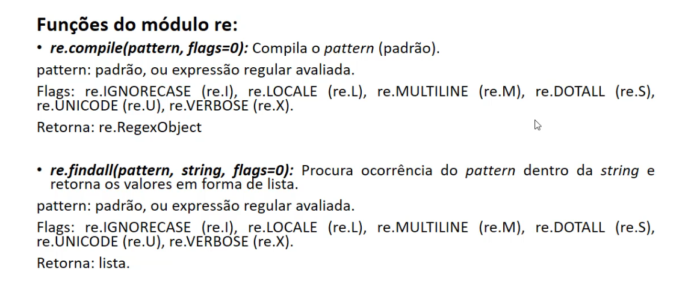
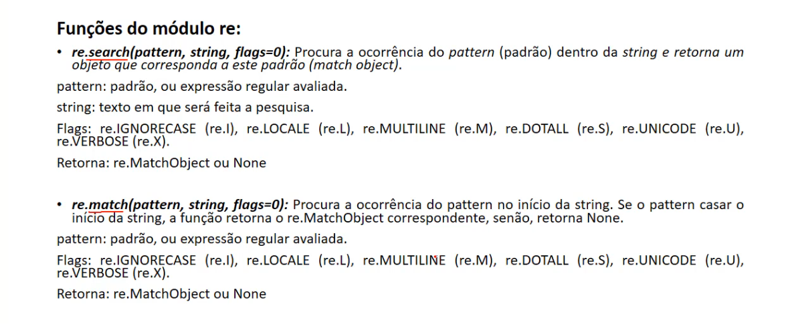
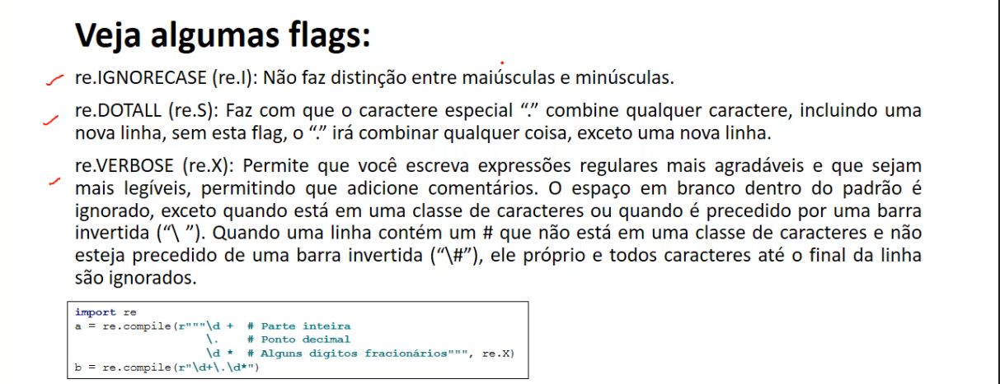
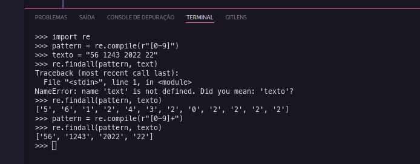
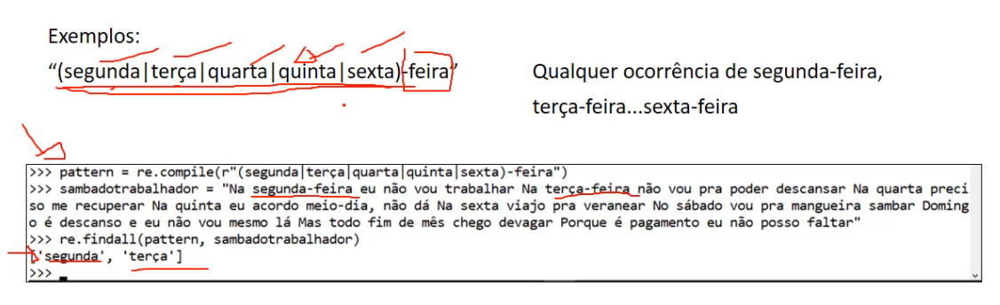
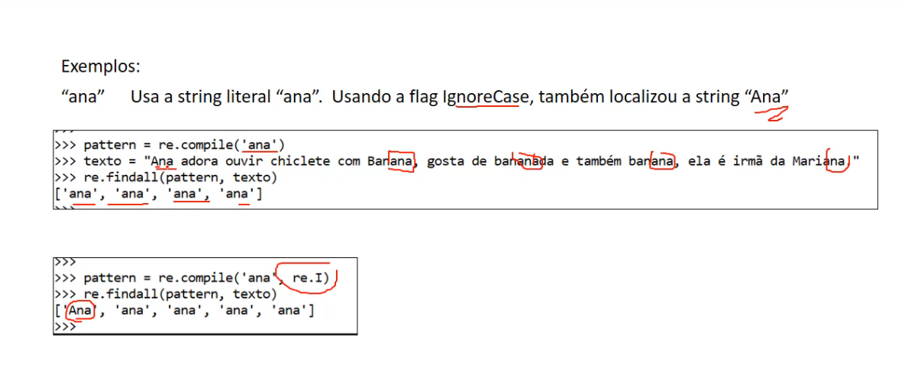
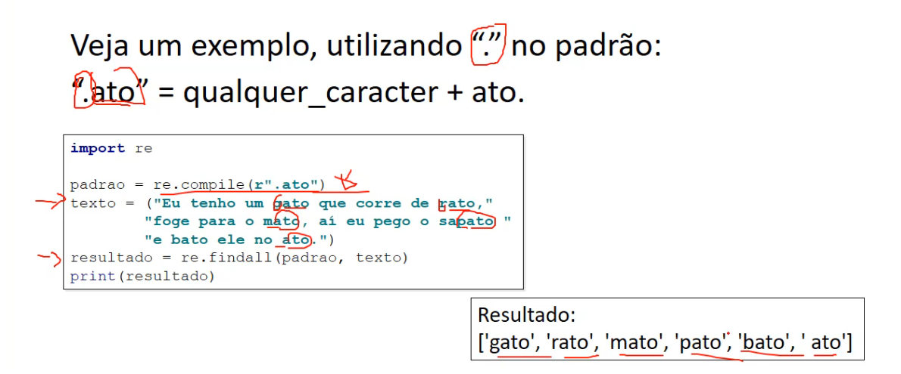
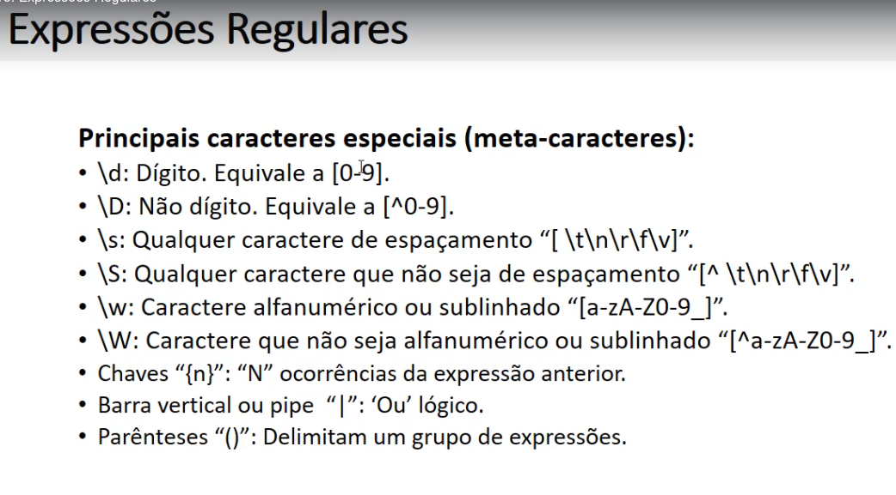

# Web scraping 
- Web scraping é a coleta de dados de terceiros em informação estruturada para uma análisse posterior
    - Escrevemos um programa p consultar um server web, solicite dados e analise-os p extrair as informações necessárias
        - Ex: Compara preços, pegar informações, etc...
## Páginas web
    - Browser faz req p server
    - server -> envia arquivos p navegador
    - Navegador faz req http que server devolve documento
    - Ex docs retornados: html, css, js
    - Quando realizamos web scraping, analisamos o html da pag

# Identificando informações de um website
- Tecnologia usada em um site pode afetar maneira que o rastreamos
## Usando biblioteca builtwith para verificar tipo tec usada em um site
```sh
pip install builtwith
# entra python
python
#importar biblioteca
import builtwith
```

### Verificar tecs usada em um site
```sh
builtwith.parse('https://www.facebook.com')
```

- Sites onde o conteúdo está embutido no html são mais fáceis de serem trabalhados
    - Sites que usam frameworks que carregam conteúdo dinamicamente ou sessões e formulários são mais complexos
## Identificando propietário de um website usando python-whois
- Importante saber
    - Ex: se a empresa for conhecida por bloquear web crawlers, seria interessante ser mais conservadores na taxa de dowload
    - Para descobrir isso, usar protocolo whois
        - Módulo do python que utiliza este protocolo -> python-whois
```sh
pip install python-whois
```
```py
import whois
print(whois.whois('globo.com'))
```

# Expressões regulares
- Módulo "re" do python fornece suport a expressões regulares no python 
- Sintaxe
```py
variavel = re.funcao(expressa_regular,  texto_onde_procurar, flags)
```

## Funções



## Flags


## Exemplos





## Usar expressões
- "."
    - Qualquer caracter menos caracter de nova linha "\n"
    - Mas se usar flag DOTALL corresponde a qualquer caracter que inclua uma nova linha

- "^"
    - Localizar padrão no **Início** do texto
    - No modo MULTILINE coincide imediatamente após cada nova linha

- "$"
    - Localizar padrão no **Fim** do texto

- "\"
    - Caractere de escape, permite usar caracteres especiais como se fosse comuns

- "[]"
    - Qualquer caracter listados entre colchetes (range). Listados individualmente ou sequencia [a-z]
    - Para filtrar o "-" temos que colocar no inicio ou fim da expressão

- "*"
    - Zero ou mais ocorrências da expressão anterior

- "+"
    - Uma ou mais ocorrências da expressão anterior

- "?"
    - Zero ou uma ocorrências da expressão anterior

- Principais caracteres especiais (meta-caracteres)
    
- Expressões regulares usam "\" p indicar formas especias ou para permitir a utilização de caracteres especiais como se fosse caracteres comuns
    - Esse comportamento conflita com o uso da ("\") no python
    - Que utiliza esse caractere para o mesmo propósito em strings literais
        - Ex: "\b" que é o caractere ASCII backspace
    - Para resolver esse problema recomenda-se prefixar a string com um "r" para indicar uma raw string (string crua)
        - Ex: 
        ```py
        print("\nOlá \bMundo")
        print(r"\nOlá \bMundo")
        ```
# Localizando CNPJs / CPFs com regex
- CNPJ
- Ex: 00.000.000/0000-00 
    - ou 00000000000000 pois "." "/" e "-" é opcional
```
([0-9]{2}[\.]?[0-9]{3}[\.]?[0-9]{3}[/]?[0-9]{4}[-]?[0-9]{2})
```
- CPF
- Ex: 000.000.000-00
    - ou 00000000000 pois "." e "-" é opcional
```
([0-9]{3}[\.]?[0-9]{3}[\.]?[0-9]{3}[-]?[0-9]{2})
```

- Dois juntos
```
([0-9]{2}[\.]?[0-9]{3}[\.]?[0-9]{3}[/]?[0-9]{4}[-]?[0-9]{2} | ([0-9]{3}[\.]?[0-9]{3}[\.]?[0-9]{3}[-]?[0-9]{2}))
```

# Localizando e-mails
[\w.-]+ -> pegando uma ou mais ocorrencias de qualquer alfanumerico, ponto e hifen
```
[\w.-]+@[\w.-]+
```

# Localizando datas em um texto
- \d -> pegar digito
```
\d{2}/\d{2}/\d{4}
```

# Usando função split p quebrar 
```py
# quebrar com base na "|"
print(re.split('\|', texto))
```

# Pegar primeira palavra e primeira letra da segunda palavra
```py
texto = 'Ola hoje to lindo'
pattern = re.compile(r"[\w]+ [\w]{1}")
match = re.match(pattern, texto).group()
print(match)
```

# Quebrar email pelo @
```py
pattern = re.compile(r'([\w.-]+)@([\w.-]+)')
resultado = re.search(pattern, text)

print("resultado.group()", resultado.group())
print("resultado.group(1)", resultado.group(1))
print("resultado.group(2)", resultado.group(2))
```
# Condicionais
```py
if resultado:
    print(resultado.group())
else:
    print("Não encontrado")
```

